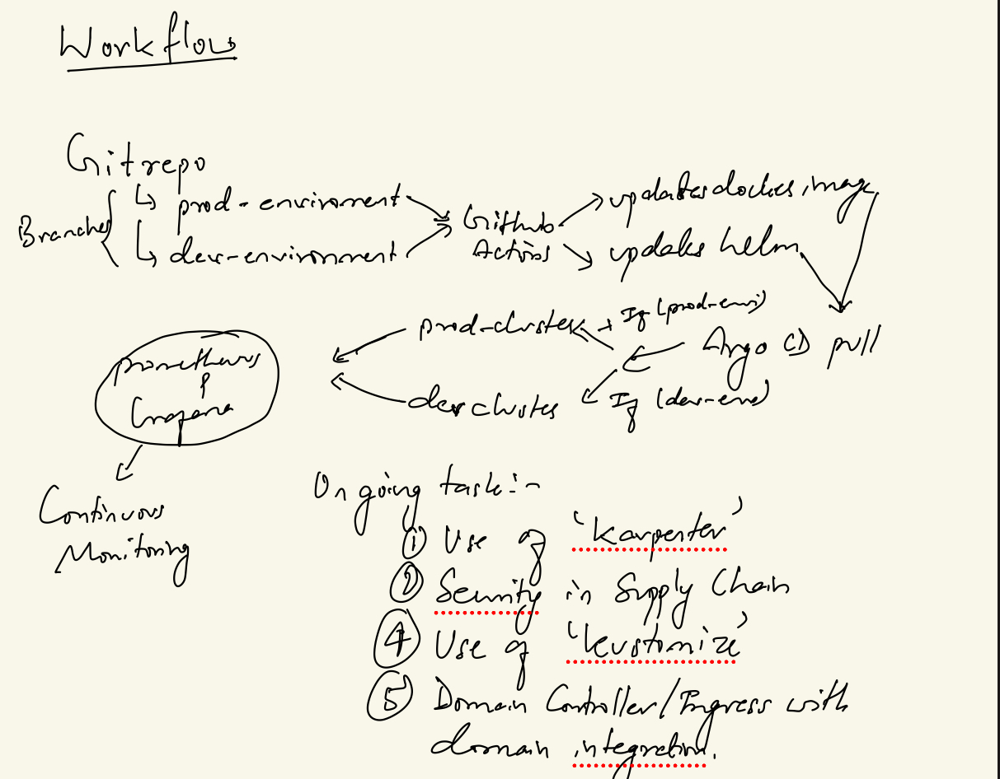

# DevSecOps-FullJavaPipeline

## 🚀 Project Overview
This project automates the deployment of a **Java-based application** using **Terraform, Kubernetes, Helm, Docker, and ArgoCD**. It incorporates **Prometheus and Grafana** for **continuous monitoring** and **GitHub Actions** for **continuous integration **.
---

## 🏗️ Infrastructure as Code (IaC) with Terraform
The entire infrastructure is provisioned using **Terraform** to manage both **Dev** and **Prod** clusters, ensuring reproducibility and infrastructure consistency.

### **📂 Directory Structure**
```
DevSecOps-FullJavaPipeline/
│── terraform/
│   ├── modules/
│   │   ├── eks/
│   │   ├── vpc/
│   ..........
│   ├── dev/
│   ├── prod/
│── helm/
│   ├── demo-javaapp/
│── demo-javaapp/
│── k8s/
│   ├── monitoring-gitops/
│   ├── java-app-gitops/
│   .......
│── README.md
```

---

## 📦 Deployment Stack & Key Features
### **🔹 Infrastructure & Cluster Management**
✅ **Terraform** for provisioning Kubernetes clusters and networking
✅ **Helm** for managing Kubernetes applications
✅ **Kubernetes (EKS)** for container orchestration

### **🔹 CI/CD & GitOps**
✅ **GitHub Actions** for automated build and CI
✅ **ArgoCD** for continuous delivery and GitOps management

### **🔹 Monitoring & Security**
✅ **Prometheus & Grafana** for real-time monitoring
✅ **Kubernetes RBAC & IAM** for secure access control

### **Ongoing works:**
✅ **use of 'karpenter'**
✅ **Security of SupplyChain**
✅ **Use of Kustomize**
✅ **Domain Controller/Ingress with domain integration**


